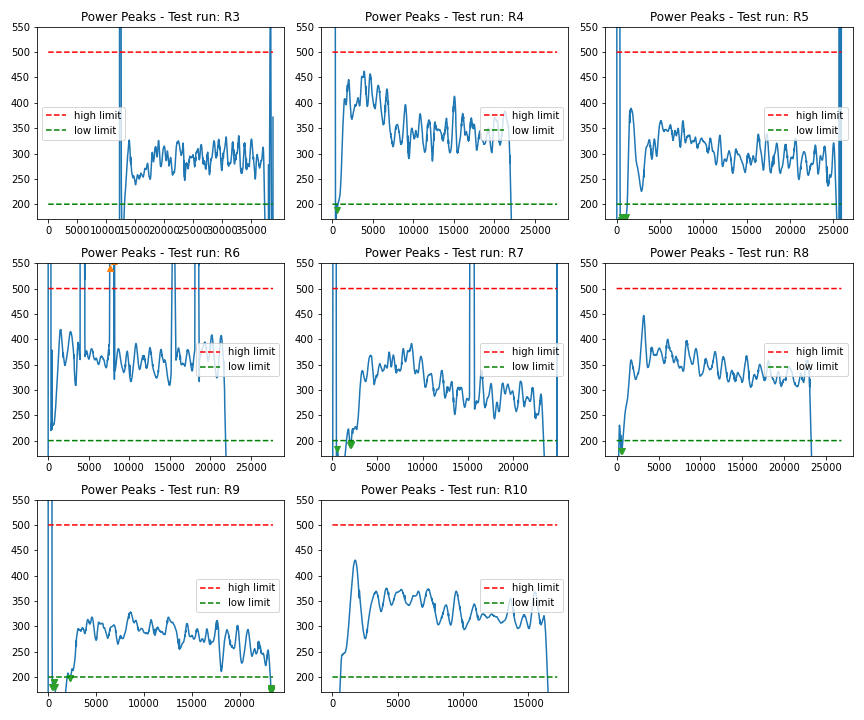
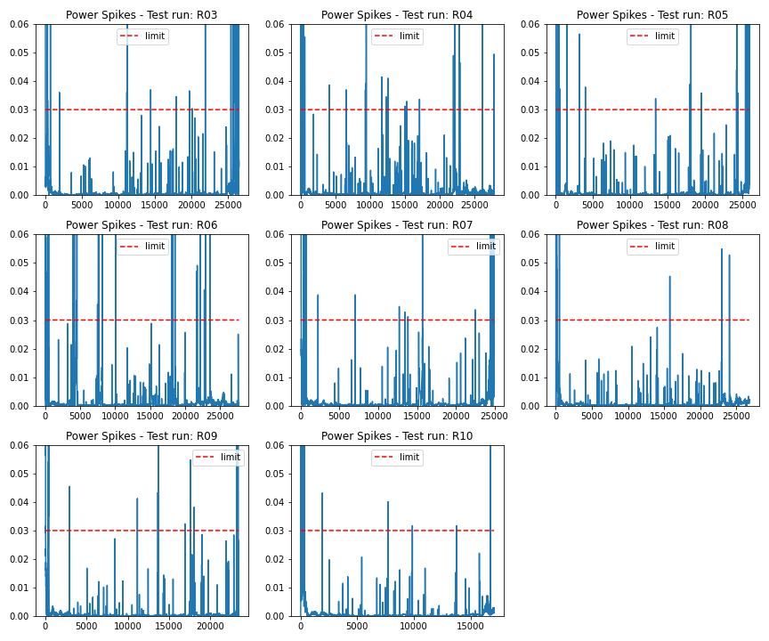
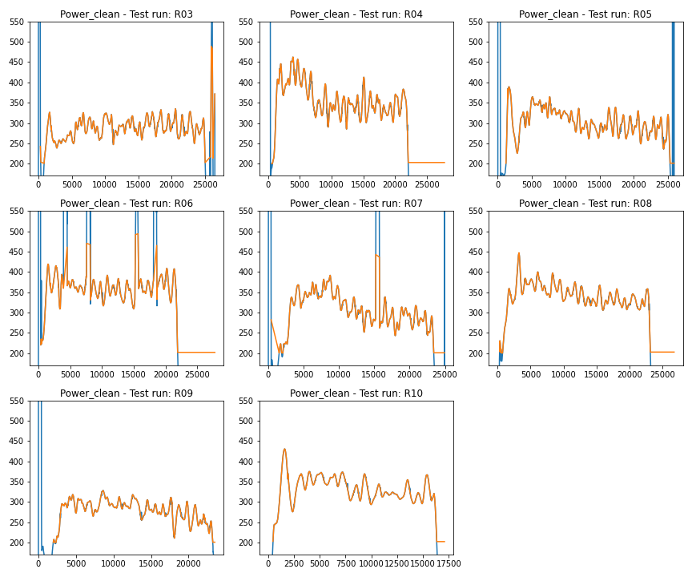

# BR Analysis Newport-010722  
Data Analysis for Test Runs at Newport  
### Data Validation  
- [Missing Data Records](MissingDataRecs.html)  
#### Data Outliers  
- [AirSpeed-Peaks](AirSpeed-Peaks.html)
- [Cadence-Peaks](Cadence-Peaks.html)
- [CdA-Peaks](CdA-Peaks.html)
- [Drag-Peaks](Drag-Peaks.html)
- [GroundSpeed-Peaks](GroundSpeed-Peaks.html)
- [Power-Peaks](Power-Peaks.html)
- [TotalWeight-Peaks](TotalWeight-Peaks.html)

#### Data Spikes  
- [AirSpeed-Spikes](AirSpeed-Spikes.html)
- [Cadence-Spikes](Cadence-Spikes.html)
- [CdA-Spikes](CdA-Spikes.html)
- [Drag-Spikes](Drag-Spikes.html)
- [GroundSpeed-Spikes](GroundSpeed-Spikes.html)
- [Power-Spikes](Power-Spikes.html)
- [TotalWeight-Spikes](TotalWeight-Spikes.html)

#### Data Cleaned  
- [AirSpeed-Cleaned](AirSpeed-Cleaned.html)
- [Cadence-Cleaned](Cadence-Cleaned.html)
- [CdA-Cleaned](CdA-Cleaned.html)
- [Drag-Cleaned](Drag-Cleaned.html)
- [GroundSpeed-Cleaned](GroundSpeed-Cleaned.html)
- [Power-Cleaned](Power-Cleaned.html)
- [TotalWeight-Cleaned](TotalWeight-Cleaned.html)

### Test Run - R3 (No Disk, Jordan)  
#### Plots  
- [AllFields](R3\Plots\AllFields.html)
- [PowerBySector](R3\Plots\PowerBySector.html)
- [SpeedBySector](R3\Plots\SpeedBySector.html)

#### Videos  

### Test Run - R4 (No Disk, Eric)  
#### Plots  
- [AllFields](R4\Plots\AllFields.html)
- [PowerBySector](R4\Plots\PowerBySector.html)
- [SpeedBySector](R4\Plots\SpeedBySector.html)

#### Videos  
- [R4-Lap10.MOV](..\Videos\R4-Lap10.MOV)
- [R4-Lap12.MOV](..\Videos\R4-Lap12.MOV)
- [R4-Lap14.MOV](..\Videos\R4-Lap14.MOV)
- [R4-Lap16.MOV](..\Videos\R4-Lap16.MOV)
- [R4-Lap18.MOV](..\Videos\R4-Lap18.MOV)
- [R4-Lap20.MOV](..\Videos\R4-Lap20.MOV)
- [R4-Lap6.MOV](..\Videos\R4-Lap6.MOV)
- [R4-Lap8.MOV](..\Videos\R4-Lap8.MOV)

### Test Run - R5 (50mm Disk, Jordan)  
#### Plots  
- [AllFields](R5\Plots\AllFields.html)
- [PowerBySector](R5\Plots\PowerBySector.html)
- [SpeedBySector](R5\Plots\SpeedBySector.html)

#### Videos  

### Test Run - R6 (50mm Disk, Eric)  
#### Plots  
- [AllFields](R6\Plots\AllFields.html)
- [PowerBySector](R6\Plots\PowerBySector.html)
- [SpeedBySector](R6\Plots\SpeedBySector.html)

#### Videos  
- [R6-Lap10.MOV](..\Videos\R6-Lap10.MOV)
- [R6-Lap12.MOV](..\Videos\R6-Lap12.MOV)
- [R6-Lap14.MOV](..\Videos\R6-Lap14.MOV)
- [R6-Lap16.MOV](..\Videos\R6-Lap16.MOV)
- [R6-Lap18.MOV](..\Videos\R6-Lap18.MOV)
- [R6-Lap20.MOV](..\Videos\R6-Lap20.MOV)
- [R6-Lap4.MOV](..\Videos\R6-Lap4.MOV)
- [R6-Lap6.MOV](..\Videos\R6-Lap6.MOV)
- [R6-Lap8.MOV](..\Videos\R6-Lap8.MOV)

### Test Run - R7 (100mm Disk, Jordan)  
#### Plots  
- [AllFields](R7\Plots\AllFields.html)
- [PowerBySector](R7\Plots\PowerBySector.html)
- [SpeedBySector](R7\Plots\SpeedBySector.html)

#### Videos  

### Test Run - R8 (100mm Disk, Eric)  
#### Plots  
- [AllFields](R8\Plots\AllFields.html)
- [PowerBySector](R8\Plots\PowerBySector.html)
- [SpeedBySector](R8\Plots\SpeedBySector.html)

#### Videos  

### Test Run - R9 (NO Disk, Jordan)  
#### Plots  
- [AllFields](R9\Plots\AllFields.html)
- [AllLaps-Air Speed](R9\Plots\AllLaps-Air+Speed.html)
- [AllLaps-Cadence Speed](R9\Plots\AllLaps-Cadence+Speed.html)
- [AllLaps-Crank Speed](R9\Plots\AllLaps-Crank+Speed.html)
- [AllLaps-Ground Speed](R9\Plots\AllLaps-Ground+Speed.html)
- [AllLaps-Power](R9\Plots\AllLaps-Power.html)
- [AllLaps-Speeds](R9\Plots\AllLaps-Speeds.html)
- [CorrPower](R9\Plots\CorrPower.html)
- [PowerByEndSector](R9\Plots\PowerByEndSector.html)
- [PowerBySector](R9\Plots\PowerBySector.html)
- [RollingCdA](R9\Plots\RollingCdA.html)
- [SpeedBySector](R9\Plots\SpeedBySector.html)
- [WindDirection](R9\Plots\WindDirection.html)

#### Videos  

### Test Run - R10 (BMC-M, NO Disk, Eric)  
#### Plots  
- [AllFields](R10\Plots\AllFields.html)
- [PowerBySector](R10\Plots\PowerBySector.html)
- [SpeedBySector](R10\Plots\SpeedBySector.html)

#### Videos  
