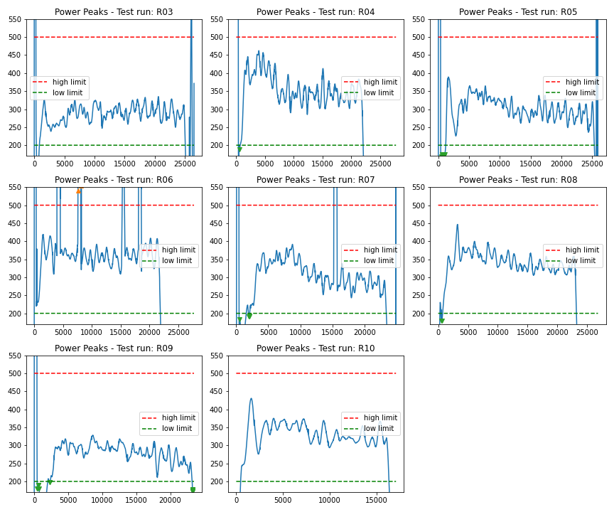

# BR Data Validation - Newport-010722  
Data Validarion for Test Runs at Newport  
### Data Validation  
- [Missing Data Records](MissingDataRecs.html)  
#### Data Outliers  
- [AirSpeed-Peaks](AirSpeed-Peaks.html)
- [Cadence-Peaks](Cadence-Peaks.html)
- [CdA-Peaks](CdA-Peaks.html)
- [Drag-Peaks](Drag-Peaks.html)
- [GroundSpeed-Peaks](GroundSpeed-Peaks.html)
- [Power-Peaks](Power-Peaks.html)
- [TotalWeight-Peaks](TotalWeight-Peaks.html)

#### Data Spikes  
- [AirSpeed-Spikes](AirSpeed-Spikes.html)
- [Cadence-Spikes](Cadence-Spikes.html)
- [CdA-Spikes](CdA-Spikes.html)
- [CrankAngleDelta-Spikes](CrankAngleDelta-Spikes.html)
- [Drag-Spikes](Drag-Spikes.html)
- [GroundSpeed-Spikes](GroundSpeed-Spikes.html)
- [Power-Spikes](Power-Spikes.html)
- [TotalWeight-Spikes](TotalWeight-Spikes.html)

#### Data Cleaned  
- [AirSpeed-Cleaned](AirSpeed-Cleaned.html)
- [Cadence-Cleaned](Cadence-Cleaned.html)
- [CdA-Cleaned](CdA-Cleaned.html)
- [CrankAngleDelta-Cleaned](CrankAngleDelta-Cleaned.html)
- [Drag-Cleaned](Drag-Cleaned.html)
- [GroundSpeed-Cleaned](GroundSpeed-Cleaned.html)
- [Power-Cleaned](Power-Cleaned.html)
- [TotalWeight-Cleaned](TotalWeight-Cleaned.html)

#### Videos  
- [R04-Lap06.MOV](..\Videos\R04-Lap06.MOV)
- [R04-Lap08.MOV](..\Videos\R04-Lap08.MOV)
- [R04-Lap10.MOV](..\Videos\R04-Lap10.MOV)
- [R04-Lap12.MOV](..\Videos\R04-Lap12.MOV)
- [R04-Lap14.MOV](..\Videos\R04-Lap14.MOV)
- [R04-Lap16.MOV](..\Videos\R04-Lap16.MOV)
- [R04-Lap18.MOV](..\Videos\R04-Lap18.MOV)
- [R04-Lap20.MOV](..\Videos\R04-Lap20.MOV)

#### Videos  

#### Videos  
- [R06-Lap04.MOV](..\Videos\R06-Lap04.MOV)
- [R06-Lap06.MOV](..\Videos\R06-Lap06.MOV)
- [R06-Lap08.MOV](..\Videos\R06-Lap08.MOV)
- [R06-Lap10.MOV](..\Videos\R06-Lap10.MOV)
- [R06-Lap12.MOV](..\Videos\R06-Lap12.MOV)
- [R06-Lap14.MOV](..\Videos\R06-Lap14.MOV)
- [R06-Lap16.MOV](..\Videos\R06-Lap16.MOV)
- [R06-Lap18.MOV](..\Videos\R06-Lap18.MOV)
- [R06-Lap20.MOV](..\Videos\R06-Lap20.MOV)

#### Videos  
- [R07-Lap04.MOV](..\Videos\R07-Lap04.MOV)
- [R07-Lap06.MOV](..\Videos\R07-Lap06.MOV)
- [R07-Lap08.MOV](..\Videos\R07-Lap08.MOV)
- [R07-Lap10.MOV](..\Videos\R07-Lap10.MOV)
- [R07-Lap12.MOV](..\Videos\R07-Lap12.MOV)
- [R07-Lap14.MOV](..\Videos\R07-Lap14.MOV)
- [R07-Lap16.MOV](..\Videos\R07-Lap16.MOV)
- [R07-Lap18.MOV](..\Videos\R07-Lap18.MOV)
- [R07-Lap20.MOV](..\Videos\R07-Lap20.MOV)

#### Videos  
- [R08-Lap04.MOV](..\Videos\R08-Lap04.MOV)
- [R08-Lap06.MOV](..\Videos\R08-Lap06.MOV)
- [R08-Lap08.MOV](..\Videos\R08-Lap08.MOV)
- [R08-Lap10.MOV](..\Videos\R08-Lap10.MOV)
- [R08-Lap12.MOV](..\Videos\R08-Lap12.MOV)
- [R08-Lap14.MOV](..\Videos\R08-Lap14.MOV)
- [R08-Lap16.MOV](..\Videos\R08-Lap16.MOV)
- [R08-Lap18.MOV](..\Videos\R08-Lap18.MOV)
- [R08-Lap20.MOV](..\Videos\R08-Lap20.MOV)

#### Videos  

#### Videos  
